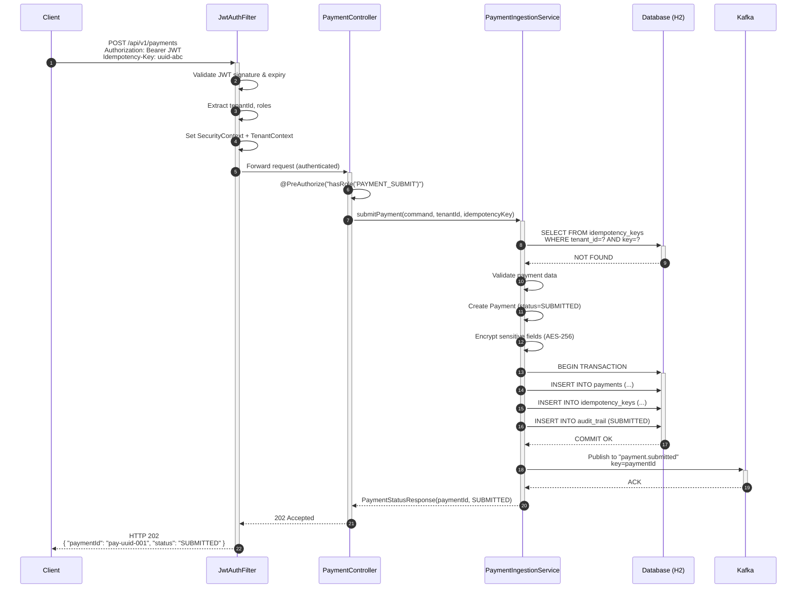
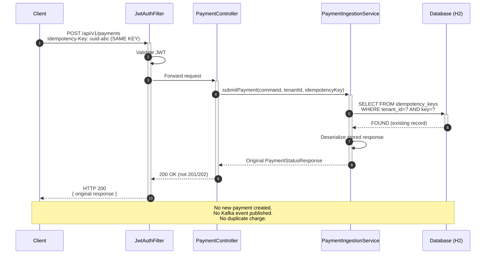
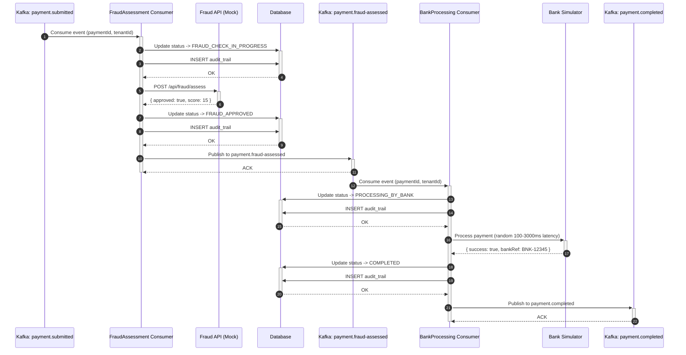
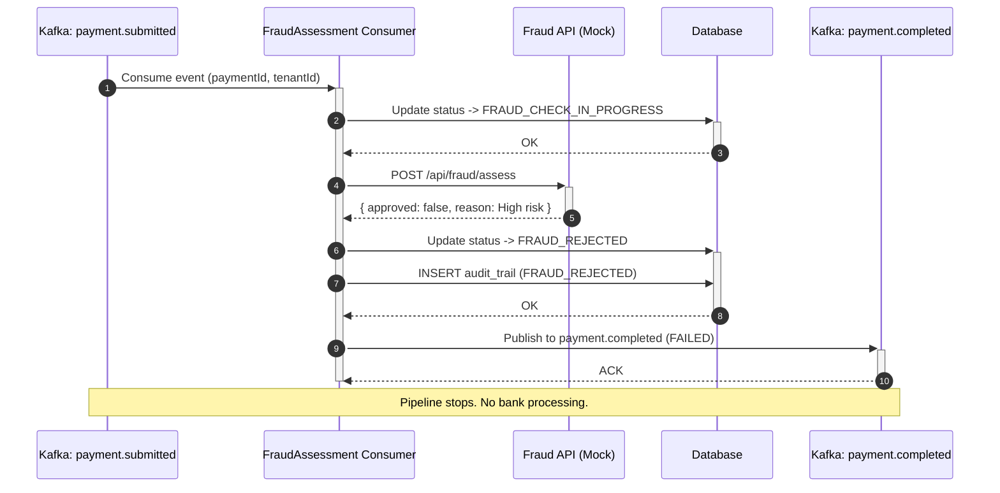
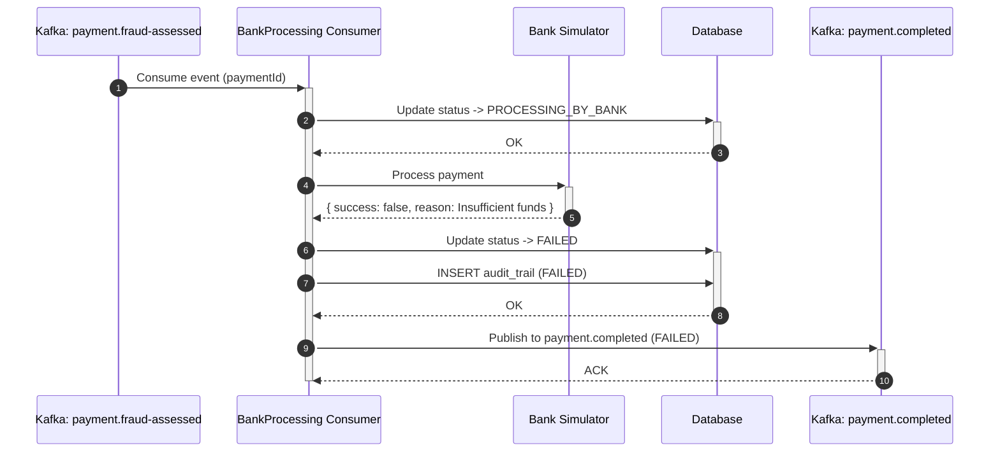
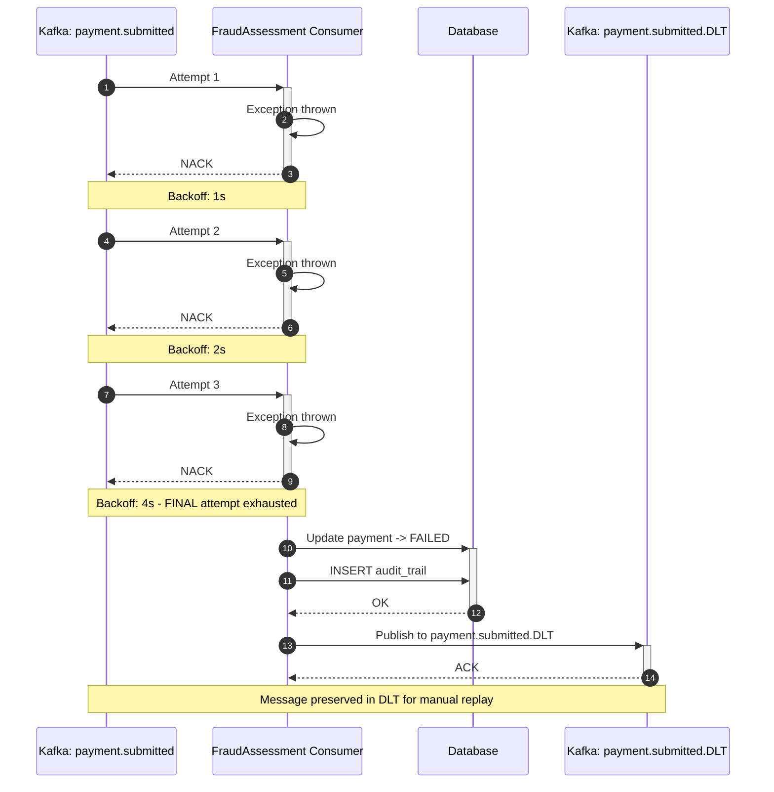
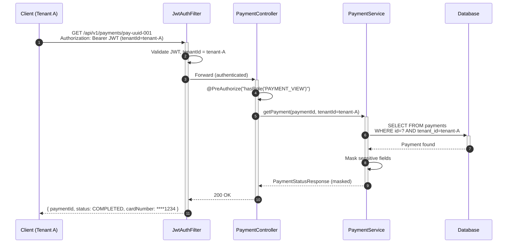
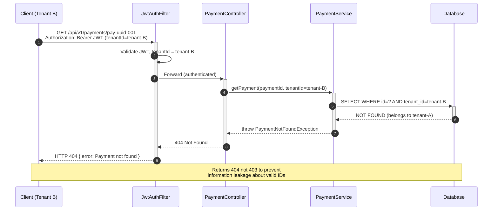
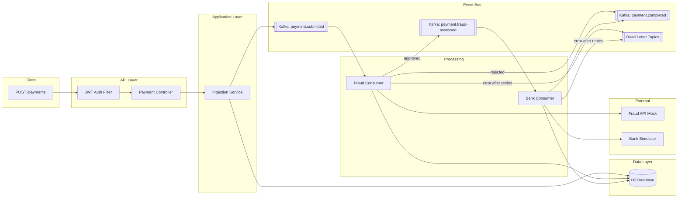
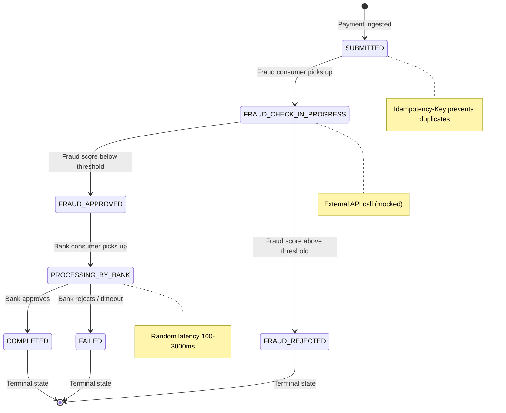

# Sequence Diagrams

All diagrams use [Mermaid](https://mermaid.js.org/) syntax and can be rendered in GitHub, GitLab, IntelliJ, or VS Code with a Mermaid plugin.

---

## 1. Payment Ingestion — Happy Path

---

## 2. Payment Ingestion — Idempotent Duplicate

---

## 3. Async Processing Pipeline — Happy Path

---

## 4. Async Processing — Fraud Rejection

---

## 5. Async Processing — Bank Failure

---

## 6. Consumer Failure — Dead Letter Topic

---

## 7. Status Inquiry — With Tenant Isolation

---

## 8. Status Inquiry — Cross-Tenant Rejection

---

## 9. Full End-to-End Flow (Overview)

---

## 10. Payment State Machine

